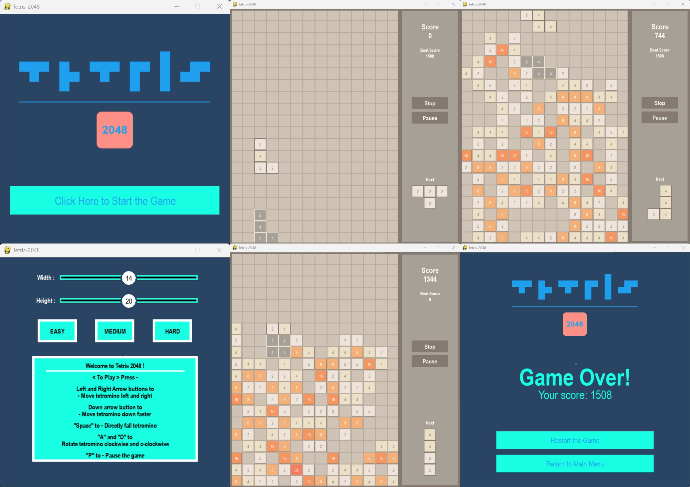

# Tetris 2048 Game

The project is a Python-based game called Tetris 2048, which has been developed using the StdDraw library included in the repository. The game is a combination of two classic games, and it includes several challenges that have been completed to enhance the gameplay experience.

The game features unique elements, such as an optimized GUI, ghost tetromino specialists, a preview of the next tetromino, a pause button, an exit button, a selection of different levels of difficulty, a splash fall feature that activates with the spacebar, and faster falling with the 's' key. Additionally, the 'd' key can be used to rotate the tetrominos, and the game includes a pause and stop feature, as well as several additional screens.

The code has been structured in a readable, modular, and efficient manner, ensuring that it can be easily understood and customized. The game provides an enjoyable and challenging experience for players and can serve as a valuable educational resource for those interested in learning more about game development.

>Some of the features of the Tetris 2048 game include:

* Developed in Python using the StdDraw library
* Combination of two classic games, with several challenges completed
* Unique elements such as optimized GUI, ghost tetromino specialists, and preview of the next tetromino
* Pause button, exit button, and selection of different levels of difficulty
* Splash fall feature activated with the spacebar, faster falling with the 's' key, and rotation of tetrominos with the 'd' key
* Readable, modular, and efficient code structure
* Pause and stop features, along with additional screens
* Enjoyable and challenging gameplay experience
* Valuable educational resource for game development enthusiasts

## Environment & Setup

> This project held by, `python 3.9.0` !

Step by step to setup;

* 1. Clone the repository to your local machine. `git clone $repository_link`
> The anaconda is used for environmental setup, if you don't have anaconda, you can directly move to step 4.
* 2. Create a virtual environment. `conda create -n ttrs python=3.9.0`
* 3. Activate the virtual environment. `conda activate ttrs`
* 4. Install the requirements. `pip install -r requirements.txt`
* 5. Run the program. Checkout @Usage section.

## Usage

> The program is designed as much dynamic as possible, it can be run directly via the main file.

You can directly run the program after your setup operations done with `python Tetris_2048.py` command.

> Have fun <3 !

## Screenshots

> The screenshots are taken from the graphical usage application.

